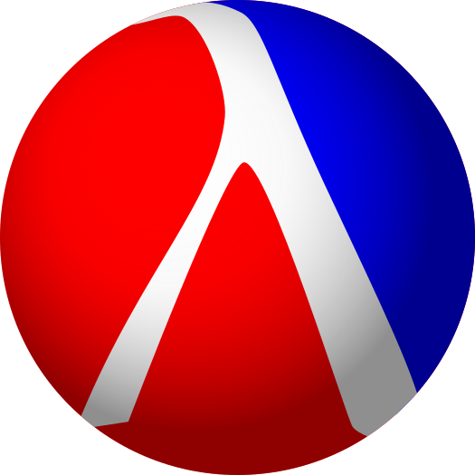

# Theory Of Algorithms Tasks

><b>Course:</b> BSc (hons) in Software Development, Year 4     
><b>Module:</b> Theory Of Algorithms   
><b>Student:</b> Patrick Moran  
><b>Stident Id:</b> g00179039  
><b>Lecturer:</b> Ian McLoughlin  

## [Contents](#contents)
* [Introduction](#intro)
* [Tasks](#tasks)
* [Overview](#overview) 
* [Functional Programming](#fp)
* [Running The Tasks](#running)
* [References](#references)

# Introduction
My name is [Patrick Moran](https://www.linkedin.com/in/patrick-moran-7a349014b/) and this repository contains Functional Programming solutions to 10 Tasks, written in Racket, which are set by our [Lecturer](https://ianmcloughlin.github.io/) throughout the semester. To view the problem sheet containing the tasks click [here](https://github.com/moranpatrick/Theory-Of-Algorithms/blob/master/Tasks.pdf). The following [section](#tasks) contains links to each task; alternatively click [here](https://github.com/moranpatrick/Theory-Of-Algorithms/tree/master/Tasks).

[Top](#contents) 

# Tasks 
| [Task1](https://github.com/moranpatrick/Theory-Of-Algorithms/tree/master/Tasks/Task1) | [Task2](https://github.com/moranpatrick/Theory-Of-Algorithms/tree/master/Tasks/Task2) | [Task3](https://github.com/moranpatrick/Theory-Of-Algorithms/tree/master/Tasks/Task3) | [Task4](https://github.com/moranpatrick/Theory-Of-Algorithms/tree/master/Tasks/Task4) | [Task5](https://github.com/moranpatrick/Theory-Of-Algorithms/tree/master/Tasks/Task5) | [Task6](https://github.com/moranpatrick/Theory-Of-Algorithms/tree/master/Tasks/Task6) | [Task7](https://github.com/moranpatrick/Theory-Of-Algorithms/tree/master/Tasks/Task7)

[Top](#contents)   

# Overview  

In this module we are given an introduction to Theory of Algorithms, focusing on the areas of computation and computability. Learning outcomes:  
* Compare different models of computation.
* Write computer programs using a selection of programming paradigms.
* Analyse the complexity of an algorithm.
* Identify difficult computational problems in everyday programming.

[Top](#contents) 

# Functional Programming
Functional Programming is a way of building computer programs that treat computation as the evaluation of mathematical functions. 

Some of the core concepts of Functional programming:  
1. Avoid state change and mutable data
2. Keep functions and data seperate
3. Treat functions as first-class citizens

It's declaritive, this means the programming is done with expressions or declarations instead of statements. During the first three and a half years of college, we have mainly looked at imperative programming e.g. Java. Imperative programming is a programming paradigm that uses statements that change a program’s state. Functional programming is declarative. Declarative programming is a programming paradigm that expresses the logic of a computation without describing its control flow. 

Some common programming languages that support functional programming are Lisp, Scheme, Racket and F#. For these tasks we will be using [Racket](https://racket-lang.org/).

## What is Racket?

  

Racket is a general-purpose programming language, a dialect of Lisp and a descendant of Scheme. To complete these tasks we'll be using the following tools:
1. Racket - The core compiler and runtime interpreter
2. DrRacket - The programming envoirnment we will use

## Installing Racket
* Simply click [here](https://download.racket-lang.org/) and follow the instructions to install Racket on your machine.
* Once installed you can now use the DrRacket programming envoirnment.
 
[Top](#contents) 

# Running The Tasks
To Run any of my solutions:
1. Clone or download this repository.
2. Make sure Racket is installed. If Racket is not installed click [here](https://download.racket-lang.org/) and follow the instructions.
3. Racket files can be found with the .rkt extension
4. Open any .rkt file in DrRacket and then run the solution with ctrl + r.

[Top](#contents) 

# References
https://en.wikipedia.org/wiki/Functional_programming  
https://racket-lang.org/  

[Top](#contents) 

