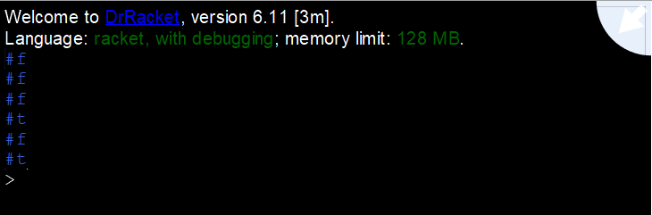

# Task 1 Decide Prime

# Problem


## What is a prime number?
A prime number is a positive number, greater than 1, which has exactly two factors; 1 and itself. Factors are two numbers that you multiply together to get a product. 

## What is a brute force algorithm?
A brute force algorithm, also known as an exhaustive algorithm, is a common problem solving technique used by going through one by one every possible candidate for a solution and checking whether each candidate satisfies the problem's statement.

Brute-force algorithms will always find a solution if it exists and they are easy to implement. The cost of is however is proportional to the number of candidate solutions, which in many practical problems tends to grow very quickly as the size of the problem increases.

# My Solution
```Racket
#lang racket

; Step 1
; As 1 is not a prime number we define a constant called
; range and assign it the value 2
(define range 2) 

; Step 2
; Define a function called decide-prime
(define (decide-prime? n)
  ; A check to to make sure the number is positive and greater that 1 otherwise return false (#f)
  (if (<= n 1)
      #f
      (not   (for/or [(x (in-range range n))]=
               (= 0 (remainder n x))))))

; Step 3
; Test our Function by passing it some numbers
; If the number passed is a prime number #t will be displayed otherwise #f

(decide-prime? 1)  ; Returns false (as 1 isn't a prime number)
(decide-prime? -8) ; Returns false (as all prime are positive)
(decide-prime? 4)  ; Returns false
(decide-prime? 11) ; Returns true 
(decide-prime? 75) ; Returns false
(decide-prime? 13) ; Returns true

```

## Output


# Findings
The most difficult part of this task was trying to get used of functional programming as I'm so used of imperative languages. I first figured out how to solve the problem in [Java](https://codereview.stackexchange.com/questions/24704/efficiently-determining-if-a-number-is-prime), then in Racket.

# References
https://codereview.stackexchange.com/questions/105174/project-euler-12-in-racket  
https://en.wikipedia.org/wiki/Brute-force_search  
https://docs.racket-lang.org/reference/booleans.html  
https://docs.racket-lang.org/reference/for.html