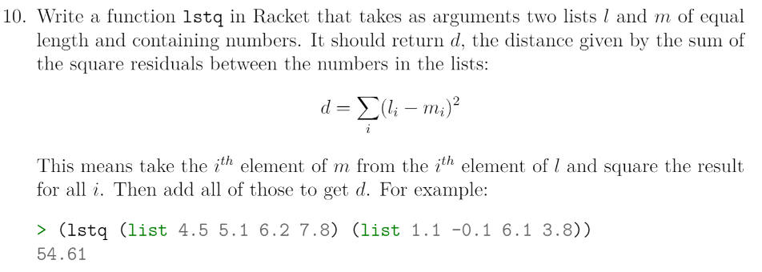
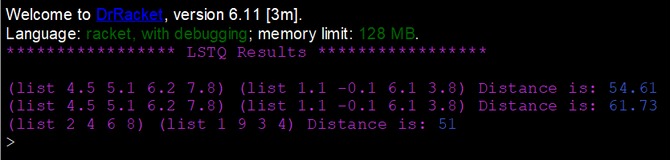

# Task 10 LSTQ

# Problem


### About this Problem


# My Solution
Full Solution with comments can be found [here](https://github.com/moranpatrick/Theory-Of-Algorithms/blob/master/Tasks/Task10/Task10.rkt).

```Racket
#lang racket


```

## Output


# Conclusion


# References


