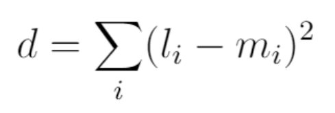

# Task 10 LSTQ

# Problem


### About this Problem
This problem consists of two lists of equal size and that contain numbers. The output of the function is first:

* Subtract m from l 
* Square it
* D is the sum of that result for each element in the list



# My Solution
Full Solution with comments can be found [here](https://github.com/moranpatrick/Theory-Of-Algorithms/blob/master/Tasks/Task10/Task10.rkt).

```Racket
#lang racket

(define (sq x)
  (* x x))

(define (lstq l m)
  (cond
     [(null? l) 0]
     [(null? m) 0]
     [(+ (sq (- (car l) (car m)))
         (lstq (cdr l) (cdr m)))]
     )
  )

(displayln "***************** LSTQ Results *****************\n")
(display "(list 4.5 5.1 6.2 7.8) (list 1.1 -0.1 6.1 3.8) Distance is: " )
(lstq (list 4.5 5.1 6.2 7.8)(list 1.1 -0.1 6.1 3.8)) ; answer 54.61

(display "(list 4.5 5.1 6.2 7.8) (list 1.1 -0.1 6.1 3.8) Distance is: " )
(lstq (list -1.4 2.2 4.9 3.4)(list 1.4 -2.9 2.7 -1.4)) ; answer 61.73

(display "(list 2 4 6 8) (list 1 9 3 4) Distance is: " )
(lstq (list 2 4 6 8)(list 1 9 3 4)) ; answer 51

```

## Output


# Conclusion


# References
http://people.cs.uchicago.edu/~adamshaw/cmsc15100-2017/typed-racket-guide/part-01.html  


