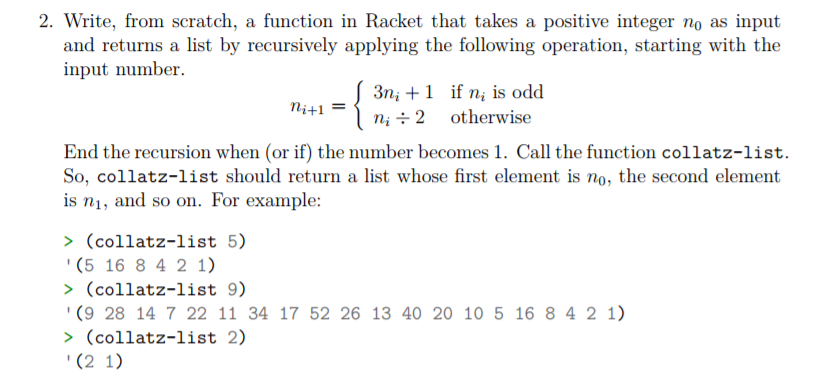
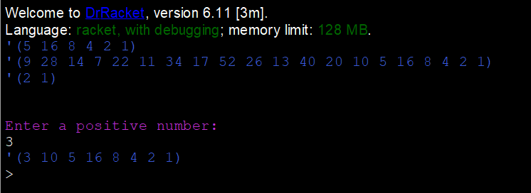

# Task 2  Collatz-list

# Problem


# Solution
```Racket
#lang racket

(define (even-odd n)
  (if (even? n)
      ; If the number is even perform this equation
      (/ n 2)
      ; Otherwise perform this equation
      (+ 1 (* 3 n))))

; Function called collatz-list which returns a list by recursively
; performing an operation depending on if the input is odd or even
(define (collatz-list n)
  (cond
    ; Check for a positive num
    [(< n 1) (displayln "You Did not Enter a positive number!")]
    ; Check when number is 1
    [(= n 1)(cons n '())] 
    ; Keep adding to the list using recursion until the number is 1
    [(> n 1)(cons n(collatz-list (even-odd n)))]))

; Test Function with Set Numbers
(collatz-list 5)
(collatz-list 9)
(collatz-list 2)

(displayln "\n")

; Test with a number from the user
(displayln "Enter a positive number:")
(collatz-list (read))

```

## Output


# References
http://cs.umw.edu/~finlayson/class/fall13/cpsc401/notes/10-racket.html   
https://docs.racket-lang.org/reference/if.html 
