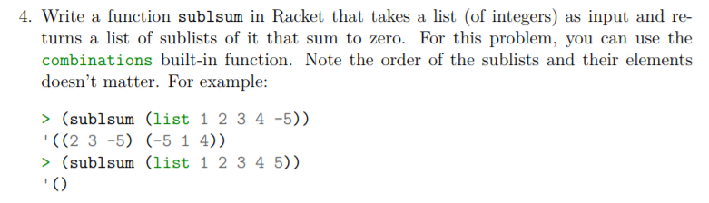
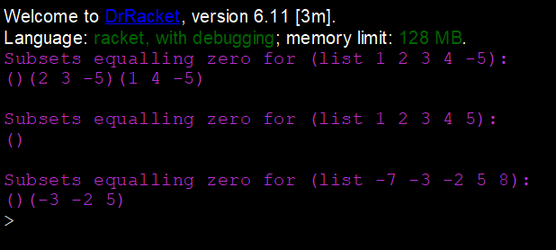

# Task 4 Sublsum

# Problem



# My Solution
Full Solution with comments can be found [here](https://github.com/moranpatrick/Theory-Of-Algorithms/blob/master/Tasks/Task3/Task4.rkt).
```Racket


```

## Output


# Conclusion


# References

