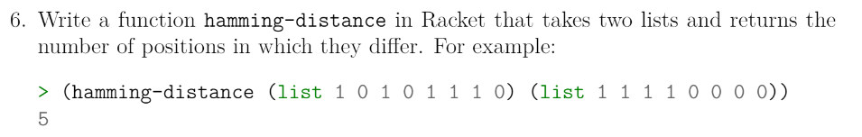
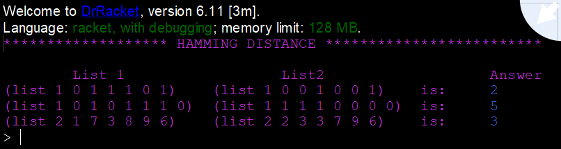

# Task 6 Hamming Distance

# Problem


### About the Problem
The Hamming Distance is the number of positions at which the corresponding symbols differ, between two strings of equal length. In other words, it counts the number of changes it would need to turn one string into the other.

Example:  


# My Solution
Full Solution with comments can be found [here](https://github.com/moranpatrick/Theory-Of-Algorithms/blob/master/Tasks/Task6/Task6.rkt).
```Racket
#lang racket

(define (hamming-distance list1 list2)
  (cond [(null? list1) 0]
        [(null? list2) 0]
        [(if(= (car list1)(car list2))
            (hamming-distance (cdr list1) (cdr list2))
            (+ 1 (hamming-distance (cdr list1) (cdr list2))))]           
        ))

(display "******************* HAMMING DISTANCE *************************\n\n")
(display "\tList 1\t\t\tList2\t\t\tAnswer\n")
(display "(list 1 0 1 1 1 0 1)\t(list 1 0 0 1 0 0 1)\tis:\t")
(hamming-distance (list 1 0 1 1 1 0 1)(list 1 0 0 1 0 0 1))

(display "(list 1 0 1 0 1 1 1 0)\t(list 1 1 1 1 0 0 0 0)\tis:\t")
(hamming-distance (list 1 0 1 0 1 1 1 0)(list 1 1 1 1 0 0 0 0))

(display "(list 2 1 7 3 8 9 6)\t(list 2 2 3 3 7 9 6)\tis:\t")
(hamming-distance (list 2 1 7 3 8 9 6)(list 2 2 3 3 7 9 6))

```

## Output


# Conclusion
I coded up this task relatively quick, adapting the previous task, Hamming-Weight. However, this solution does assume that both lists are of equal length.

# References
https://en.wikipedia.org/wiki/Hamming_distance  
https://docs.racket-lang.org/reference/if.html#%28form._%28%28lib._racket%2Fprivate%2Fletstx-scheme..rkt%29._cond%29%29  


