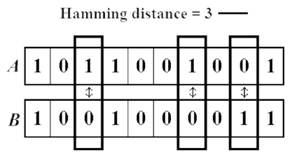

# Task 6 Hamming Distance

# Problem


### About the Problem
The Hamming Distance is the number of positions at which the corresponding symbols differ, between two strings of equal length. In other words, it counts the number of changes it would need to turn one string into the other.

Example:  


# My Solution
Full Solution with comments can be found [here](https://github.com/moranpatrick/Theory-Of-Algorithms/blob/master/Tasks/Task6/Task6.rkt).
```Racket


```

## Output


# Conclusion


# References
https://en.wikipedia.org/wiki/Hamming_distance  


