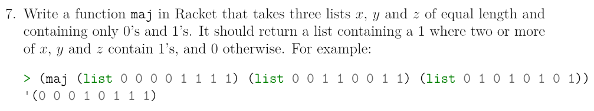
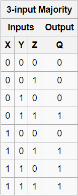
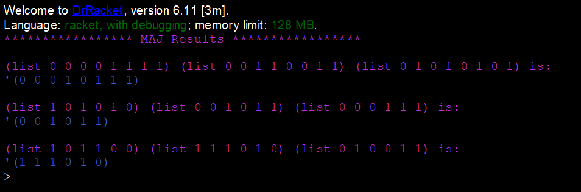

# Task 7 Maj Function

# Problem


### About the Problem
The majority function, also called the median operator, is a function from n number of inputs to one output. In our task we are using 1's and 0's, returning a 1 if two or more elements at the same position in each list are a 1, otherwise a 0 is returned.

Examples:  


# My Solution
Full Solution with comments can be found [here](https://github.com/moranpatrick/Theory-Of-Algorithms/blob/master/Tasks/Task7/Task7.rkt).
```Racket
#lang racket

(define (maj x y z)
  (cond 
        [(null? x) '()]
        [ (= (car x) (car y))
          (cons (car x) (maj (cdr x) (cdr y) (cdr z)))]
        [(= (car x) (car z))
         (cons (car x) (maj (cdr x) (cdr y) (cdr z)))]
        [else (cons (car y) (maj (cdr x) (cdr y) (cdr z)))]
        )
  )

; Test Results
(displayln "***************** MAJ Results *****************\n")
(displayln "(list 0 0 0 0 1 1 1 1) (list 0 0 1 1 0 0 1 1) (list 0 1 0 1 0 1 0 1) is:" )
(maj (list 0 0 0 0 1 1 1 1) (list 0 0 1 1 0 0 1 1) (list 0 1 0 1 0 1 0 1))

(displayln "\n(list 1 0 1 0 1 0) (list 0 0 1 0 1 1) (list 0 0 0 1 1 1) is:" )
(maj (list 1 0 1 0 1 0) (list 0 0 1 0 1 1) (list 0 0 0 1 1 1)) 

(displayln "\n(list 1 0 1 1 0 0) (list 1 1 1 0 1 0) (list 0 1 0 0 1 1) is:" )
(maj (list 1 0 1 1 0 0) (list 1 1 1 0 1 0) (list 0 1 0 0 1 1)) 

```

## Output


# Conclusion
It should be noted, that an assumption was made, that all the lists are of equal size. Because of this and that the number of types (0 ,1) is only 2, I was able to figure out the logic quicker than I thought. 

# References
https://en.wikipedia.org/wiki/Majority_function


