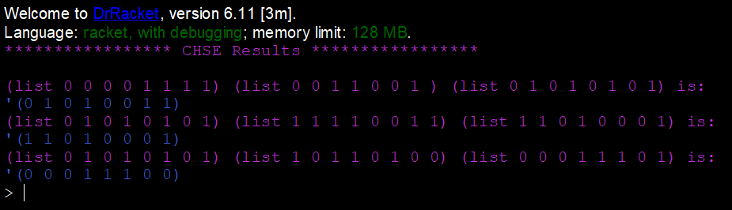

# Task 8 CHSE

# Problem


# My Solution
Full Solution with comments can be found [here](https://github.com/moranpatrick/Theory-Of-Algorithms/blob/master/Tasks/Task8/Task8.rkt).
```Racket
#lang racket

(define (chse x y z)
  (cond
    [(null? x)'()] 
    [(null? y)'()]
    [(null? y)'()]
    [ (if(= (car x) 1)
         (cons(car y)(chse(cdr x)(cdr y)(cdr z)))
         (cons(car z)(chse(cdr x)(cdr y)(cdr z))))]
    )
  )

; Test Cases
(displayln "***************** CHSE Results *****************\n")
(displayln "(list 0 0 0 0 1 1 1 1) (list 0 0 1 1 0 0 1 ) (list 0 1 0 1 0 1 0 1) is:" )
(chse (list 0 0 0 0 1 1 1 1) (list 0 0 1 1 0 0 1 1) (list 0 1 0 1 0 1 0 1))

(displayln "(list 0 1 0 1 0 1 0 1) (list 1 1 1 1 0 0 1 1) (list 1 1 0 1 0 0 0 1) is:" )
(chse (list 0 1 0 1 0 1 0 1) (list 1 1 1 1 0 0 1 1) (list 1 1 0 1 0 0 0 1))

(displayln "(list 0 1 0 1 0 1 0 1) (list 1 0 1 1 0 1 0 0) (list 0 0 0 1 1 1 0 1) is:" )
(chse (list 0 1 0 1 0 1 0 1) (list 1 0 1 1 0 1 0 0) (list 0 0 0 1 1 1 0 1))

```

## Output


# Conclusion
After completing task 7, this task wasn't too difficult and was completed relatively quick. It should be noted that, this solution works with list inputs of the same size and with list elements of 1's and 0's.

# References
https://github.com/moranpatrick/Theory-Of-Algorithms/blob/master/Tasks/Task7/Task7.rkt  


