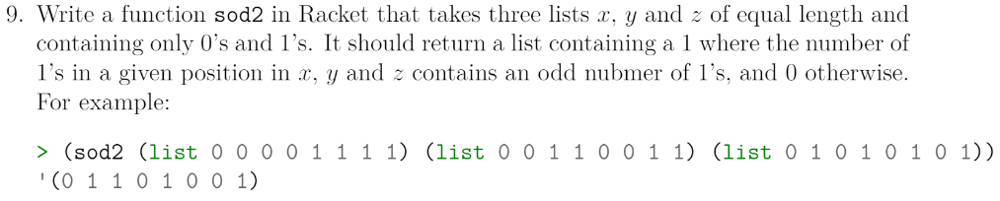
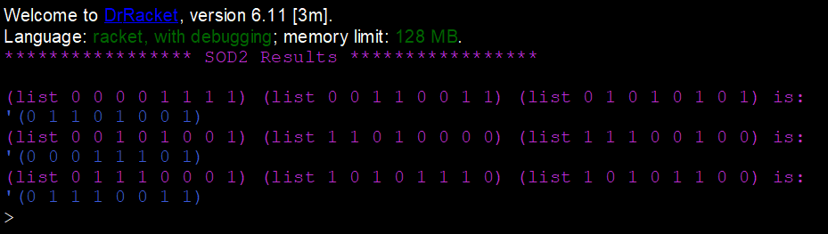

# Task 9 SOD2

# Problem


### About this Problem
This problem consists of three lists of equal size and contains only 1's and 0's. The output of the function is a new list containing a 1 if the number of 1's in a current position in each list is odd, otherwise a 0. First I check for null inputs from the three lists. Then I sum the first elements in each list and find out if they are odd or even using the modulo operation. Depending on odd or even I add a 1 or 0 to the list and recurse on the sod2 function.

# My Solution
Full Solution with comments can be found [here](https://github.com/moranpatrick/Theory-Of-Algorithms/blob/master/Tasks/Task9/Task9.rkt).
```Racket
#lang racket

(define (sod2 x y z)
  (cond
     [(null? x)'()]
     [(null? y)'()]
     [(null? z)'()]
     [(if(= 0 (modulo (+ (car x) (car y) (car z)) 2))
         (cons 0 (sod2 (cdr x) (cdr y) (cdr z)))
         (cons 1 (sod2 (cdr x) (cdr y) (cdr z))))]
     )
  )

(displayln "***************** SOD2 Results *****************\n")
(displayln "(list 0 0 0 0 1 1 1 1) (list 0 0 1 1 0 0 1 1) (list 0 1 0 1 0 1 0 1) is:" )
(sod2 (list 0 0 0 0 1 1 1 1) (list 0 0 1 1 0 0 1 1) (list 0 1 0 1 0 1 0 1))

(displayln "(list 0 0 1 0 1 0 0 1) (list 1 1 0 1 0 0 0 0) (list 1 1 1 0 0 1 0 0) is:" )
(sod2 (list 0 0 1 0 1 0 0 1) (list 1 1 0 1 0 0 0 0) (list 1 1 1 0 0 1 0 0))

(displayln "(list 0 1 1 1 0 0 0 1) (list 1 0 1 0 1 1 1 0) (list 1 0 1 0 1 1 0 0) is:" )
(sod2 (list 0 1 1 1 0 0 0 1) (list 1 0 1 0 1 1 1 0) (list 1 0 1 0 1 1 0 0))

```

## Output


# Conclusion
After using modulo operation in a previous task I figured this would be the easiest way to handle odd and even operations without using Rackets own odd and even functions. After figuring the logic in my head the task became straight forward and really just an adaption of the cond function that I've been using for most tasks. 

# References
https://docs.racket-lang.org/reference/generic-numbers.html?q=modulo#%28def._%28%28quote._~23~25kernel%29._modulo%29%29    
https://github.com/moranpatrick/Theory-Of-Algorithms/blob/master/Tasks/Task8/Task8.rkt


